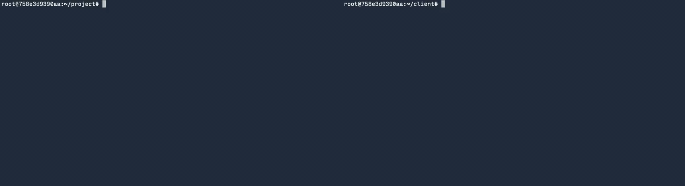

gRPC Object Detector
--------------------
[](https://app.circleci.com/pipelines/github/vishnu3649m/grpc-object-detector)
[](https://app.codecov.io/gh/vishnu3649m/grpc-object-detector)
[]()

An object detection service for images via gRPC.



## Introduction

This project was started to explore gRPC and to see how well it can be used for providing 
object detection as a service. It runs a deep learning-based object detector on
your images to detect objects.

Feel free to fork this repo and adapt this for your own object detection services.

This server provides the following services:
- `GetDetectableObjects`: Returns the list of objects the server can detect
- `DetectImage`: Returns a list of detections for an image
- `DetectMultipleImages`: Takes in a stream of images and responds with a stream of detection responses for those images in order

Refer to the [protos](protos) directory for exact details of the gRPC services.

There are 2 detectors included:
- `cascade_face_detector`: A Haar cascade classifier found in OpenCV. (Was used to quickly set up a detector to test the server)
- `onnx_yolov4_coco`: A YOLOv4 model trained on COCO (from the [ONNX model zoo](https://github.com/onnx/models/tree/master/vision/object_detection_segmentation/yolov4)). 

You can add your own detectors. See the section ["Adding your own detectors"](#adding-your-own-detectors) below.

## Building, Installing, Testing & Running
gRPC Object Detector is currently developed for 64-bit Linux only.

#### Dependencies
gRPC Object Detector was written using C++17. A compiler that supports C++17 is needed.
Only GCC has been tested. The CMake build system is used to build the project
and the minimum required version is 3.13.

gRPC Object Detector depends on the following libraries to be pre-installed:
- gRPC: v1.37.0 or greater (Refer [here](https://github.com/grpc/grpc/blob/master/BUILDING.md) for instructions on how to build gRPC)
- absl: can be installed together with gRPC
- OpenCV: v3.2 or greater (Hardware acceleration and other optimizations provided by specific backends is dependent on your specific installation)
- ONNX Runtime: v1.7.x (Refer [here](https://www.onnxruntime.ai/docs/how-to/build/inferencing.html) for instructions on how to build `libonnxruntime`. Note: it should be built as a shared library and installed in a location discoverable by CMake.)
- Pthreads

(For details on how to install necessary dependencies, see [`tools`](tools) for the Dockerfile and scripts used for CI/CD setup. You can pull the docker image `vishnu3649m/grpc-objdet-circleci` which is used for CI/CD)

The following third-party libraries are included as submodules within this repo:
- [Loguru](https://github.com/emilk/loguru) (for logging)
- [CLI11](https://github.com/CLIUtils/CLI11) (for command-line parsing and handling)
- [xtensor](https://xtensor.readthedocs.io/en/latest/) (for multi-dimensional array processing)

#### Building and Installing
```shell
git clone --recursive https://github.com/vishnu3649m/grpc-object-detector.git
cd grpc-object-detector
mkdir build && cd build
cmake -DCMAKE_BUILD_TYPE=Release ..
make -j $(nproc) && make install
```

#### Running the server

> NOTE:</br>The object detectors need the files within the `config` folder to 
> initialize. It is important to run the server from this directory so detectors
> can find the config files upon startup.

```
gRPC Object Detector
Usage: grpc-objdet-server [OPTIONS]

Options:
  -h,--help                   Print this help message and exit
  -V,--version                Prints version info and exits
  -d,--detector-type TEXT REQUIRED
                              The type of detector to serve
```

For example, to serve a YOLOv4 model trained on the COCO dataset, run:
```shell
grpc-objdet-server -d onnx_yolov4_coco
```

#### Running the tests
Tests are built by default when running make within the `build` directory. To run:
```shell
./build/test-objdet-server
```
> NOTE:</br>Like what was mentioned for running the server, it is important to run the
> tests from this directory for it to find the config files (to initialize the 
> detectors) and for it to use the data files within `tests/data`.

## Adding your own detectors
To create a detector for the server to serve, subclass `ObjDet::DetectorInterface` 
and implement all necessary methods. Refer to the [header](src/grpc_obj_det/DetectorInterface.h) 
for the methods' signature and purpose.

The server loads detectors using this factory method: `ObjDet::DetectorFactory::get_detector`. 
This method creates an instance of the requested detector and returns it. Register
your concrete detector implementation with the factory by assigning a name for
it and adding an entry within the factory method. This name should be specified
as the `-d` option of `grpc-objdet-server`.
